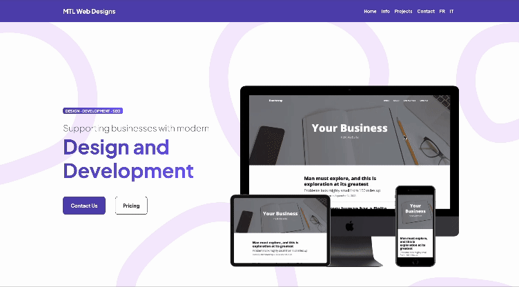

# 🌟 MTL Web Designs : [Visit Here](http://mtlwebdesigns.com/)

MTL Web Designs is my web development agency dedicated to creating responsive websites for small businesses, aimed at boosting their online presence with straightforward, effective, and fully functional designs. The site is multilingual, supporting  content in English, French, and Italian languages.

## How It's Made:

**Tech used:** HTML, CSS, JavaScript, Bootstrap, [i18nextify](https://github.com/i18next/i18nextify/tree/master).

## Optimizations
Using [i18nextify](https://github.com/i18next/i18nextify/tree/master) made the internalization faster and more maintainable without requiring more complex solutions.

## Lessons Learned:
Working on this project has been instrumental in expanding my design skills, optimizing performance, and enhancing website aesthetics. It has also enriched my technical proficiency and introduced me to new tools that facilitate superior outcomes. Beyond technical aspects, I've gained insights into satisfying clients, designing visually appealing interfaces, and accommodating diverse client requirements effectively.

