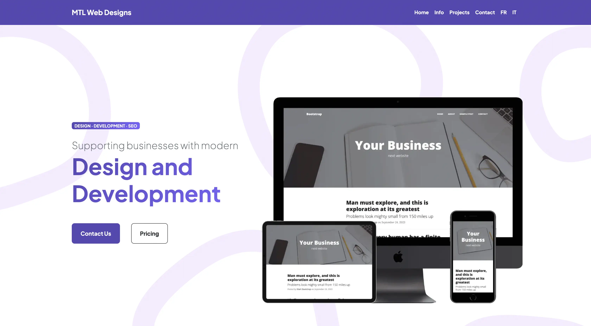

# 🌟 MTL Web Designs Agency
I'm starting building my agency to provide responsive websites to small businesses, and help them grow their online presence. Providing simple, effective, and fully functional websites at affordable prices.

## How It's Made:

**Tech used:** HTML, CSS, JavaScript, Bootstrap.

Started from a Bootstrap template and integrated i18n using [i18nextify](https://github.com/i18next/i18nextify/tree/master) 

## Optimizations

Using [i18nextify](https://github.com/i18next/i18nextify/tree/master) made the internalization faster and more maintainable without requiring any back-end application or using multiple html files

## Lessons Learned:

This project is helping me learn more about design, making things work faster, and making websites look better. I'm getting better at what I know, and I'm finding new tools to help me do even better.

I'm not just learning about the technical stuff; I'm also figuring out how to make customers happy, design things that look good, and handle different clients' needs.